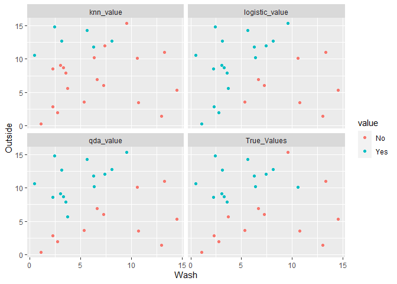

Example 1
=========

### Small training set

    e=0.3 # error term
    set.seed(46) # allows reproducable code with random number generator

    # First, we make a training set
    N=20 # training sample size
    Age = sample(20:80,size=N,replace=T)     # Creating a random sample of ages between 50 and 90
    Avg_work_out <- sample(0:40,size=N,replace=T) # Creating a random sample of toilet paper rolls between 0 and 40
    prob_Hospitalized <- exp(-3+.14*Age-.2*Avg_work_out)/(exp(-3+.14*Age-.2*Avg_work_out)+1)+rnorm(n=N,mean=0,sd=e) # probability of sent to ICU
    # logit probability: always between 0 and 1 (besides rnorm function to add random variation)
    # Decision boundary is a diagnal line.

    Hospitalized <- ifelse(prob_Hospitalized>0.5,"Yes","No") # These are the true values for whether a patient is sent to ICU

    data1_train <- data.frame(Age,Avg_work_out,Hospitalized)
    data1_train %>% 
      ggplot(.,aes(x=Age,y=Avg_work_out,color=Hospitalized)) + geom_point()  + # plot of the training sample true values
      labs(title= "Training Set")

    # Second, we make a testing set
    M = 20 # testing sample size
    Age = sample(20:80,size=M,replace=T)
    Avg_work_out <- sample(0:40,size=M,replace=T)

    prob_Hospitalized <- exp(-3+.14*Age-.2*Avg_work_out)/(exp(-3+.14*Age-.2*Avg_work_out)+1)+rnorm(n=M,mean=0,sd=e) # probability of sent to ICU
    Hospitalized <- ifelse(prob_Hospitalized>0.5,"Yes","No")

    data1_test <- data.frame(Age,Avg_work_out,Hospitalized) 
    data1_test %>% 
      ggplot(.,aes(x=Age,y=Avg_work_out,color=Hospitalized))+ 
      geom_point() +
      labs(title= "Testing Set")

    # Third, we train our 3 classifiers on the training set then test them on the testing set
    knn_values <- knn(data1_train[,1:2],data1_test[,1:2],data1_train[,3],k=8) # KNN with k = 8

    qda.fit = qda(Hospitalized ~ Age + Avg_work_out, data=data1_train)   # QDA training
    qda.class = predict(qda.fit,data1_test)$class # QDA classifying

    logistic.fit = glm(Hospitalized~Age+Avg_work_out,data=data1_train,family=binomial) # Logistic Regression training
    glm.probs=predict(logistic.fit,data1_test,type="response") # Logistic Regression predicting probability
    #contrasts(data1_train$Hospitalized) # No coded as 0, Yes coded as 1
    logistic.pred=rep("No",M) 
    logistic.pred[glm.probs >.5]="Yes" # Logistic Regression classifying based on predicted probabilities
    logistic.pred=as.factor(logistic.pred) 

    data1_test = data1_test %>%     # Adding all classifiers to the same dataframe 
      mutate(knn_value = knn_values) %>% 
      mutate(qda_value = qda.class) %>% 
      mutate(logistic_value = logistic.pred)

    mean(data1_test[,3]!=knn_values) #error rate for knn

    ## [1] 0.15

    mean(data1_test[,3]!=qda.class)  #error rate for qda

    ## [1] 0.2

    mean(data1_test[,3]!=logistic.pred) #error rate for logistic regression

    ## [1] 0.15

    data1_test %>%      # Plotting the true test values versus the 3 predictions
      rename(True_Values = Hospitalized) %>% 
      pivot_longer(cols=3:6,names_to="z") %>% 
      ggplot(.,aes(x=Age,y=Avg_work_out,color=value)) + geom_point() +
      facet_wrap(.~z)

### large training set

    # large training set.
    e=0.3 # error term
    set.seed(46) # allows reproducable code with random number generator

    # First, we make a training set
    N=1000 # training sample size
    Age = sample(20:80, size=N, replace=T) # Creating a random sample of ages between 20 and 80
    Avg_work_out <- sample(0:40,size=N,replace=T) # Creating a random sample of toilet paper rolls between 0 and 40
    prob_Hospitalized <- exp(-3+.14*Age-.2*Avg_work_out)/(exp(-3+.14*Age-.2*Avg_work_out)+1)+rnorm(n=N,mean=0,sd=e) # probability of sent to ICU
    # logit probability: always between 0 and 1 (besides rnorm function to add random variation)

    Hospitalized <- ifelse(prob_Hospitalized>0.5,"Yes","No") # These are the true values for whether a patient is sent to ICU

    data1_train <- data.frame(Age,Avg_work_out,Hospitalized)
    data1_train %>% 
      ggplot(.,aes(x=Age,y=Avg_work_out,color=Hospitalized)) +
      geom_point() + # plot of the training sample true values
      labs(title= "Training Set")

    # Second, we make a testing set
    M = 20 # testing sample size
    Age = sample(20:80, size = M,replace=T)
    Avg_work_out <- sample(0:40, size = M,replace=T)

    prob_Hospitalized <- exp(-3+.14*Age-.2*Avg_work_out)/(exp(-3+.14*Age-.2*Avg_work_out)+1)+rnorm(n=M,mean=0,sd=e) # probability of sent to ICU
    Hospitalized <- ifelse(prob_Hospitalized>0.5,"Yes","No")

    data1_test <- data.frame(Age, Avg_work_out, Hospitalized) 
    data1_test %>% 
      ggplot(.,aes(x=Age,y=Avg_work_out,color=Hospitalized))+ 
      geom_point() +
      labs(title= "Testing Set")

    # Third, we train our 3 classifiers on the training set then test them on the testing set
    knn_values <- knn(data1_train[,1:2],data1_test[,1:2],data1_train[,3],k=8) # KNN with k = 8

    qda.fit = qda(Hospitalized ~ Age + Avg_work_out, data=data1_train)   # QDA training
    qda.class = predict(qda.fit,data1_test)$class # QDA classifying

    logistic.fit = glm(Hospitalized~Age+Avg_work_out,data=data1_train,family=binomial) # Logistic Regression training
    glm.probs=predict(logistic.fit,data1_test,type="response") # Logistic Regression predicting probability
    #contrasts(data1_train$Hospitalized) # No coded as 0, Yes coded as 1
    logistic.pred=rep("No",M) 
    logistic.pred[glm.probs >.5]="Yes" # Logistic Regression classifying based on predicted probabilities
    logistic.pred=as.factor(logistic.pred) 

    data1_test = data1_test %>%   # Adding all classifiers to the same dataframe 
      mutate(knn_value = knn_values) %>% 
      mutate(qda_value = qda.class) %>% 
      mutate(logistic_value = logistic.pred)

    mean(data1_test[,3]!=knn_values) #error rate for knn

    ## [1] 0.1

    mean(data1_test[,3]!=qda.class)  #error rate for qda

    ## [1] 0.2

    mean(data1_test[,3]!=logistic.pred) #error rate for logistic regression

    ## [1] 0.25

    data1_test %>%      # Plotting the true test values versus the 3 predictions
      rename(True_Values = Hospitalized) %>% 
      pivot_longer(cols=3:6,names_to="z") %>% 
      ggplot(.,aes(x=Age,y=Avg_work_out,color=value)) + geom_point() +
      facet_wrap(.~z)

### large sample

    # large sample

    e=0.3 # error term

    set.seed(46) # allows reproducable code with random number generator

    # First, we make a training set
    N=100000 # training sample size
    Age = sample(20:80,size=N,replace=T)     # Creating a random sample of ages between 50 and 90
    Avg_work_out<- sample(0:40,size=N,replace=T) # Creating a random sample of toilet paper rolls between 0 and 40
    prob_Hospitalized <- exp(-3+.14*Age-.2*Avg_work_out)/(exp(-3+.14*Age-.2*Avg_work_out)+1)+rnorm(n=N,mean=0,sd=e) # probability of sent to ICU

    Hospitalized <- ifelse(prob_Hospitalized>0.5,"Yes","No") # These are the true values for whether a patient is sent to ICU

    data1_train <- data.frame(Age,Avg_work_out,Hospitalized)
    data1_train %>% 
      ggplot(.,aes(x=Age,y=Avg_work_out,color=Hospitalized)) + geom_point(size=1)+ # plot of the training sample true values
      geom_jitter(width = .3, height =.3)+
      labs(title= "Large Sample")

Example 2: QDA Best
===================

### Small training set

    e=.3
    set.seed(14) #
    N=25 # training sample size
    Wash=runif(n=N,min=0,max=15)
    Outside <- runif(n=N,min=0,max=16)
    prob_Infect<- exp(-15 -.25*Wash^2 + .4*Outside^2 - .0001*Wash^6)/(exp(-15
    -.25*Wash^2 + .4*Outside^2 - .0001*Wash^6)+1) + rnorm(n=N,mean=0,sd=e)
    # Once again I used a logit function to keep probabilities between 0 and 1.
    #I added more complex terms to create the desired curved Baye's decision line
    Infect <- ifelse(prob_Infect>0.5,"Yes","No")
    data2_train <- data.frame(Wash,Outside,Infect)
    data2_train %>%
    ggplot(.,aes(x=Wash,y=Outside,color=Infect)) + geom_point(size=1) + labs(title= "Training Set")

    M = N # testing sample size
    Wash=runif(n=N,min=0,max=15)
    Outside <- runif(n=N,min=0,max=16)
    prob_Infect<- exp(-15 -.25*Wash^2 + .4*Outside^2 - .0001*Wash^6)/(exp(-15
    -.25*Wash^2 + .4*Outside^2 - .0001*Wash^6)+1) + rnorm(n=N,mean=0,sd=e)
    # Decision boundary is about Wash = 70
    Infect <- ifelse(prob_Infect>0.5,"Yes","No")
    data2_test <- data.frame(Wash,Outside,Infect)
    data2_test %>%
    ggplot(.,aes(x=Wash,y=Outside,color=Infect)) + geom_point() + labs(title= "Testing Set")

    knn_values <- knn(data2_train[,1:2],data2_test[,1:2],data2_train[,3],k=8)
    #knn with k = 8
    qda.fit = qda(Infect ~ Wash + Outside, data=data2_train) # qda
    qda.class = predict(qda.fit,data2_test)$class
    logistic.fit = glm(Infect~Wash+Outside,data=data2_train,family=binomial)

    ## Warning: glm.fit: algorithm did not converge

    ## Warning: glm.fit: fitted probabilities numerically 0 or 1 occurred

    glm.probs=predict(logistic.fit,data2_test,type="response")
    #contrasts(data2_train$Infect) # No coded as 0, Yes coded as 1
    logistic.pred=rep("No",M)
    logistic.pred[glm.probs >.5]="Yes"
    logistic.pred=as.factor(logistic.pred)
    data2_test = data2_test %>%
    mutate(knn_value = knn_values) %>%
    mutate(qda_value = qda.class) %>%
    mutate(logistic_value = logistic.pred)
    mean(data2_test[,3]!=knn_values) #error rate for knn

    ## [1] 0.28

    mean(data2_test[,3]!=qda.class) #error rate for qda

    ## [1] 0.12

    mean(data2_test[,3]!=logistic.pred) #error rate for logistic regression

    ## [1] 0.24

    data2_test %>%
    rename(True_Values = Infect) %>%
    pivot_longer(cols=3:6,names_to="z") %>%
    ggplot(.,aes(x=Wash,y=Outside,color=value)) + geom_point() +
    facet_wrap(.~z)

### Large training set

    e=.3
    set.seed(15) #
    N=1000 # training sample size
    Wash=runif(n=N,min=0,max=15)
    Outside <- runif(n=N,min=0,max=16)
    prob_Infect<- exp(-15 -.25*Wash^2 + .4*Outside^2 - .0001*Wash^6)/(exp(-15
    -.25*Wash^2 + .4*Outside^2 - .0001*Wash^6)+1) + rnorm(n=N,mean=0,sd=e)
    # Once again I used a logit function to keep probabilities between 0 and 1.
    # I added more complex terms to create the desired curved Baye's decision line
    Infect <- ifelse(prob_Infect>0.5,"Yes","No")
    data2_train <- data.frame(Wash,Outside,Infect)
    data2_train %>%
    ggplot(.,aes(x=Wash,y=Outside,color=Infect)) + geom_point(size=2) + labs(title= "Training Set")

    M = 25 # testing sample size
    Wash=runif(n=M,min=0,max=15)
    Outside <- runif(n=M,min=0,max=16)
    prob_Infect<- exp(-15 -.25*Wash^2 + .4*Outside^2 - .0001*Wash^6)/(exp(-15
    -.25*Wash^2 + .4*Outside^2 - .0001*Wash^6)+1) + rnorm(n=M,mean=0,sd=e)
    # Decision boundary is about Wash = 70
    Infect <- ifelse(prob_Infect>0.5,"Yes","No")
    data2_test <- data.frame(Wash,Outside,Infect)
    data2_test %>%
    ggplot(.,aes(x=Wash,y=Outside,color=Infect)) + geom_point() + labs(title= "Testing Set")

    knn_values <- knn(data2_train[,1:2],data2_test[,1:2],data2_train[,3],k=8)
    #knn with k = 8
    qda.fit = qda(Infect ~ Wash + Outside, data=data2_train) # qda
    qda.class = predict(qda.fit,data2_test)$class
    logistic.fit = glm(Infect~Wash+Outside,data=data2_train,family=binomial)
    glm.probs=predict(logistic.fit,data2_test,type="response")
    #contrasts(data2_train$Infect) # No coded as 0, Yes coded as 1
    logistic.pred=rep("No",M)
    logistic.pred[glm.probs >.5]="Yes"
    logistic.pred=as.factor(logistic.pred)
    data2_test = data2_test %>%
    mutate(knn_value = knn_values) %>%
    mutate(qda_value = qda.class) %>%
    mutate(logistic_value = logistic.pred)
    mean(data2_test[,3]!=knn_values) #error rate for knn

    ## [1] 0

    mean(data2_test[,3]!=qda.class) #error rate for qda

    ## [1] 0

    mean(data2_test[,3]!=logistic.pred) #error rate for logistic regression

    ## [1] 0.08

    data2_test %>%
    rename(True_Values = Infect) %>%
    pivot_longer(cols=3:6,names_to="z") %>%
    ggplot(.,aes(x=Wash,y=Outside,color=value)) + geom_point() +
    facet_wrap(.~z)

    e=.3
    set.seed(14) #
    N=10000 # training sample size
    Wash=runif(n=N,min=0,max=15)
    Outside <- runif(n=N,min=0,max=16)
    prob_Infect<- exp(-15 -.25*Wash^2 + .4*Outside^2 - .0001*Wash^6)/(exp(-15
    -.25*Wash^2 + .4*Outside^2 - .0001*Wash^6)+1) + rnorm(n=N,mean=0,sd=e)
    # Once again I used a logit function to keep probabilities between 0 and 1.
    #I added more complex terms to create the desired curved Baye's decision line
    Infect <- ifelse(prob_Infect>0.5,"Yes","No")
    data2_train <- data.frame(Wash,Outside,Infect)
    data2_train %>%
    ggplot(.,aes(x=Wash,y=Outside,color=Infect)) + geom_point(size=1) + labs(title= "Large Sample")

Example 3
=========

### small training data

    e = .2
    set.seed(1) #
    N = 100 # training sample size
    RH = sample(x = c(35, 50, 65, 80),
                size = N,
                replace = T)
    # random sample of relative humidities
    Temp <- sample (x = c(5, 20),
                    size = N,
                    replace = T)
    # random sample of temperatures
    condition <- function(A, B) {
      # function for conditional probability of infection
      if (A == 35) {
        .75 + rnorm(n = 1, mean = 0, sd = e)
      } else if (A == 50 & B == 5) {
        .75 + rnorm(n = 1, mean = 0, sd = e)
      } else if (A == 50 & B == 20) {
        .25 + rnorm(n = 1, mean = 0, sd = e)
      } else if (A == 65 & B == 5) {
        .25 + rnorm(n = 1, mean = 0, sd = e)
      } else if (A == 65 & B == 20) {
        .75 + rnorm(n = 1, mean = 0, sd = e)
      } else if (A == 80 & B == 5) {
        .25 + rnorm(n = 1, mean = 0, sd = e)
      } else if (A == 80 & B == 20) {
        0 + rnorm(n = 1, mean = 0, sd = e)
      }
    }
    data3_train <- data.frame(RH, Temp)
    data3_train = data3_train %>%
      mutate (prob_Transmitted = mapply(FUN = condition, A = RH, B = Temp)) %>%
      # creating true values for probability of transmission
      mutate(Transmitted = ifelse(prob_Transmitted > 0.5, "Yes", "No")) %>%
      # classifying true values
      mutate(Transmitted = as.factor(Transmitted))
    data3_train %>%
      ggplot(., aes(x = RH, y = Temp, color = Transmitted)) + 
      geom_jitter(size = 2) + 
      labs(title = "Training Set")

    # a jitter plot is used because the values overlap
    M = N # testing sample size
    RH = sample(x = c(35, 50, 65, 80),
                size = N,
                replace = T)
    Temp <- sample (x = c(5, 20),
                    size = N,
                    replace = T)
    data3_test <- data.frame(RH, Temp)
    data3_test = data3_test %>%
      mutate (prob_Transmitted = mapply(FUN = condition, A = RH, B = Temp)) %>%
      mutate(Transmitted = ifelse(prob_Transmitted > 0.5, "Yes", "No")) %>%
      mutate(Transmitted = as.factor(Transmitted))
    data3_test %>%
      ggplot(., aes(x = RH, y = Temp, color = Transmitted)) + 
      geom_jitter(size = 2) +
      labs(title = "Testing Set")

    knn_values <-
      knn(data3_train[, 1:2], data3_test[, 1:2], data3_train[, 4], k = 8)
    #knn with k = 8
    qda.fit = qda(Transmitted ~ RH + Temp, data = data3_train) # qda
    qda.class = predict(qda.fit, data3_test)$class
    logistic.fit = glm(Transmitted ~ RH + Temp, data = data3_train, family =
                         binomial)
    glm.probs = predict(logistic.fit, data3_test, type = "response")
    #contrasts(data3_train$Transmitted) # No coded as 0, Yes coded as 1
    logistic.pred = rep("No", M)
    logistic.pred[glm.probs > .5] = "Yes"
    logistic.pred = as.factor(logistic.pred)
    data3_test = data3_test %>%
      mutate(knn_value = knn_values) %>%
      mutate(qda_value = qda.class) %>%
      mutate(logistic_value = logistic.pred)
    mean(data3_test[, 4] != knn_values) #error rate for knn

    ## [1] 0.15

    mean(data3_test[, 4] != qda.class) #error rate for qda

    ## [1] 0.33

    mean(data3_test[, 4] != logistic.pred) #error rate for logistic regression

    ## [1] 0.33

    data3_test %>%
      rename(True_Values = Transmitted) %>%
      pivot_longer(cols = 4:7, names_to = "z") %>%
      ggplot(., aes(x = RH, y = Temp, color = value)) + geom_jitter(size = 1) +
      facet_wrap(. ~ z)

### Large training set

    e = .2
    set.seed(1) #
    N = 1000 # training sample size
    RH = sample(x = c(35, 50, 65, 80),
                size = N,
                replace = T)
    # random sample of relative humidities
    Temp <- sample (x = c(5, 20),
                    size = N,
                    replace = T)
    # random sample of temperatures
    condition <- function(A, B) {
      # function for conditional probability of infection
      if (A == 35) {
        .75 + rnorm(n = 1, mean = 0, sd = e)
      } else if (A == 50 & B == 5) {
        .75 + rnorm(n = 1, mean = 0, sd = e)
      } else if (A == 50 & B == 20) {
        .25 + rnorm(n = 1, mean = 0, sd = e)
      } else if (A == 65 & B == 5) {
        .25 + rnorm(n = 1, mean = 0, sd = e)
      } else if (A == 65 & B == 20) {
        .75 + rnorm(n = 1, mean = 0, sd = e)
      } else if (A == 80 & B == 5) {
        .25 + rnorm(n = 1, mean = 0, sd = e)
      } else if (A == 80 & B == 20) {
        0 + rnorm(n = 1, mean = 0, sd = e)
      }
    }
    data3_train <- data.frame(RH, Temp)
    data3_train = data3_train %>%
      mutate (prob_Transmitted = mapply(FUN = condition, A = RH, B = Temp)) %>%
      # creating true values for probability of transmission
      mutate(Transmitted = ifelse(prob_Transmitted > 0.5, "Yes", "No")) %>%
      # classifying true values
      mutate(Transmitted = as.factor(Transmitted))
    data3_train %>%
      ggplot(., aes(x = RH, y = Temp, color = Transmitted)) + 
      geom_jitter(size = 2) + 
      labs(title = "Training Set")

    # a jitter plot is used because the values overlap
    M = 100 # testing sample size
    RH = sample(x = c(35, 50, 65, 80),
                size = M,
                replace = T)
    Temp <- sample (x = c(5, 20),
                    size = M,
                    replace = T)
    data3_test <- data.frame(RH, Temp)
    data3_test = data3_test %>%
      mutate (prob_Transmitted = mapply(FUN = condition, A = RH, B = Temp)) %>%
      mutate(Transmitted = ifelse(prob_Transmitted > 0.5, "Yes", "No")) %>%
      mutate(Transmitted = as.factor(Transmitted))
    data3_test %>%
      ggplot(., aes(x = RH, y = Temp, color = Transmitted)) + 
      geom_jitter(size = 2) +
      labs(title = "Testing Set")

    knn_values <-
      knn(data3_train[, 1:2], data3_test[, 1:2], data3_train[, 4], k = 8)
    #knn with k = 8
    qda.fit = qda(Transmitted ~ RH + Temp, data = data3_train) # qda
    qda.class = predict(qda.fit, data3_test)$class
    logistic.fit = glm(Transmitted ~ RH + Temp, data = data3_train, family =
                         binomial)
    glm.probs = predict(logistic.fit, data3_test, type = "response")
    #contrasts(data3_train$Transmitted) # No coded as 0, Yes coded as 1
    logistic.pred = rep("No", M)
    logistic.pred[glm.probs > .5] = "Yes"
    logistic.pred = as.factor(logistic.pred)
    data3_test = data3_test %>%
      mutate(knn_value = knn_values) %>%
      mutate(qda_value = qda.class) %>%
      mutate(logistic_value = logistic.pred)
    mean(data3_test[, 4] != knn_values) #error rate for knn

    ## [1] 0.14

    mean(data3_test[, 4] != qda.class) #error rate for qda

    ## [1] 0.31

    mean(data3_test[, 4] != logistic.pred) #error rate for logistic regression

    ## [1] 0.31

    data3_test %>%
      rename(True_Values = Transmitted) %>%
      pivot_longer(cols = 4:7, names_to = "z") %>%
      ggplot(., aes(x = RH, y = Temp, color = value)) + geom_jitter(size = 1) +
      facet_wrap(. ~ z)

### Large sample

    e=.2
    set.seed(1) #
    N=10000 # training sample size
    RH=sample(x=c(35,50,65,80),size=N,replace=T)
    # random sample of relative humidities
    Temp <- sample (x=c(5,20),size=N,replace=T)
    # random sample of temperatures
    data3_train <- data.frame(RH,Temp)
    data3_train=data3_train %>%
    mutate (prob_Transmitted = mapply(FUN=condition,A=RH,B=Temp)) %>%
    # creating true values for probability of transmission
    mutate(Transmitted = ifelse(prob_Transmitted>0.5,"Yes","No")) %>%
    # classifying true values
    mutate(Transmitted = as.factor(Transmitted))
    data3_train %>%
    ggplot(.,aes(x=RH,y=Temp,color=Transmitted)) + geom_jitter(size=1) + labs(title="Large Sample")

